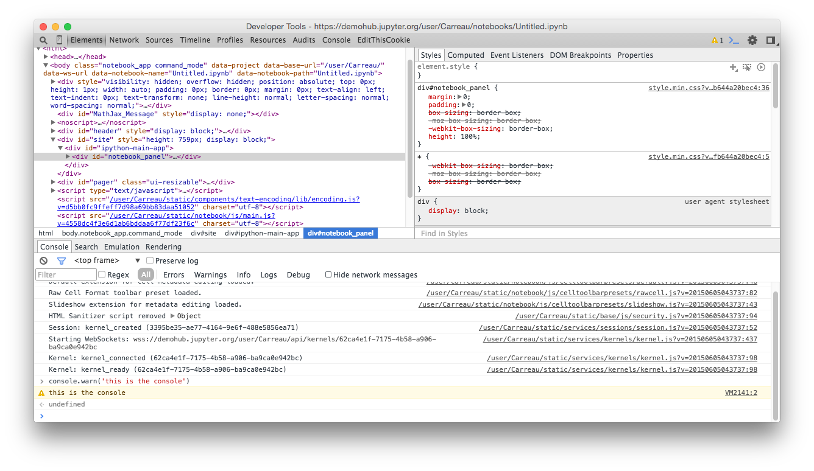

# The Things of the Web. 

Hello reader, welcome to the beautiful world of Jupyter Notebook. 
One of the reason Jupyter Notebook is so awesome is because it leverage technologies from the web. This allow you to do a large number of things for free, like video, and audio in the Browser. 

If you want to hack and understand how the notebook works to fully appreciate it's potential, you have to get familiar with a few technologies of the web.

This chapter is here to give you the necessary basics on web technologies. We will also introduce the core tools you want to use when hacking on the web. 


## The webrowser


One of the key tool you use all the time when working on the web your web browser. I'm sure you use your browser everyday, but your browser can be both your best ally, or worth enemy. The number of functionalities that your browser have and can do is pretty large. Describing all the things can take days, so we will focus on the basics. I encourage you to learn more about what your browser can you by yourself. 


### Browser Choice 

As a browser of choice I will use Chrome. Chrome comes by default with a lot of baked in tools, so you will not need to install any extensions. The interface will be also consistent regardless of the Os you are using. 

If you are more a fan of Firefox, I would suggest you to install the developer edition. It comes preconfigured with many defaults. It is possible to set-up default firefox to behave like developer edition, but it can take some time.


Your other major browser are Safari on MacOS, and Internet Explorer for Windows. Unfortunately, I am not familiar with either of them. 
As far as I know you can make most of what we will do in Safari. You might just have to enable developer mode in the advance preferences.

## Developer tools. 

The developer tools are a number of panels that allow you to interact with the web page in a way much different than usual browsing. You can sort of see that as a powerful debugger that allow you to modify and inspect the running page live. 

To open the developer tools, in **Chrome**, go to the `View > Developer > Developer Tools`.
I suggest you learn the keyboard shortcut to open the Dev Tools. It's probably one of the shortcut you will use the most (with switching windows) in this tutorial.




Ok, so let's look at different area of the developer tool you will be interested in.

#### DOM Tree

The far left tab, named `Elements` is the tab that allow you to view the current structure of the DOM. 
We won't really dive into what the DOM. In a first approximation, the DOM is the current state of the HTML. You want to be to this tab if you are trying to inspect or modify the structure of the DOM. 

One of the useful things is the small magnifying glass even more on the left that the `Elements`. 
It allow you to click on a visual element in a page, and get it selected on the tree view. 


Ok, let's try to mess a bit with the DOM. In the tree view on the upper left, try to double click and edit some element of the DOM. You will see that when you hover the tree, the relevant part on the view highlight. Try to figure out where the cell, the pager, and toolbar are in a notebook page. 


#### Css inspector. 

On the right of the DOM Tree view is the Css inspector. The Css inspector allows you to observe and modify the Sss rules that apply to the current selected element. It is basically  these rules that describe the layout and appearance of the notebook page.

#### Javascript console

The last part of the Devtools that we will use today is the javascript console. 
It is basicaly like an IPython console prompt, though it run in the context of the page, and accept only javascript. 

It is in different than usual REPL in the sense that the javascript on the page is continually executing and does not Pause while you type at the prompt. 

Let's try the basic of the console. 

```javascript
> console.log('Hello Jupyter Notebook')
```

You can also run a task in the background.

```
> setInterval(function(){console.log('hi there')}, 3000)
```

This will print every 3 seconds. When it annoys you enough, refresh your page, all your changes will be gone. 

Let's try something more visual:

```
> $('.cell:even').slideUp('slow').slideDown('slow')
```

We won't get into details, but you did something equivalent to numpy broadcasting. You applied a function to a collection of elements of the DOM.


